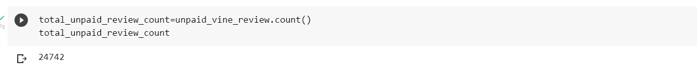

# Amazon_Vine_Analysis

## Overview & Purpose

The purpose of this project is to analyze Amazon reviews written by members of the paid Amazon Vine Program. The Amazon Vine program is a service that allows manufacturers and publishers to receive reviews for their products. Some companies pay a small fee to Amazon and provide products to Amazon Vine members, who are then required to publish a review.

For this project, the Automotive databse was selected from the [Amazon Review Datasets](https://s3.amazonaws.com/amazon-reviews-pds/tsv/index.txt) and PySpark was used to perform the ETL process to extract the dataset, transform the data, connect to an AWS RDS instance, and load the transformed data into pgAdmin (PostgreSQL). Then PySpark was used to determine if there is any bias toward favorable reviews from Vine members in the dataset.

## Data Source
[Automotive](https://s3.amazonaws.com/amazon-reviews-pds/tsv/amazon_reviews_us_Automotive_v1_00.tsv.gz) Dataset

## Tools Used
- PySpark
- Google Colab Notebooks
- Amazon Web Services RDS
- PostgreSQL(pgAdmin)

## Results

- How many vine reviews and non-vine reviews were there?

The number of total paid vine reviews - 82
The number of total unpaid vine reviews - 24,742

![] (images/total_paid_review.png)

