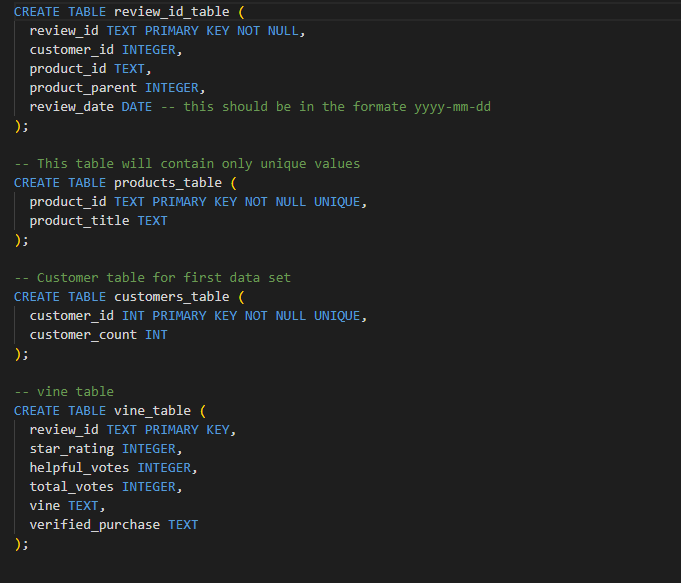
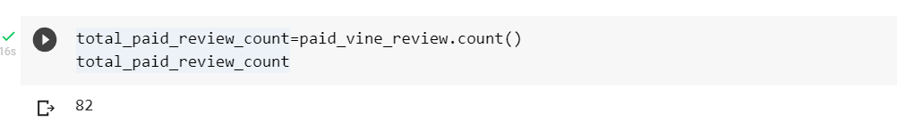
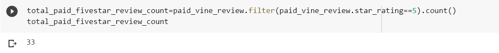
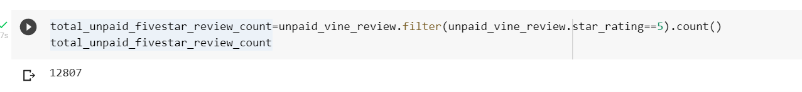
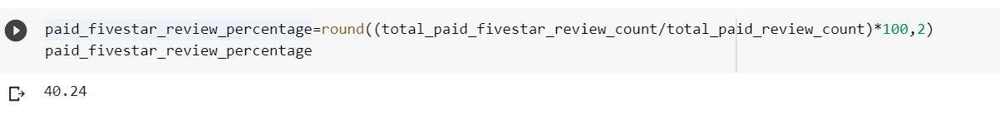
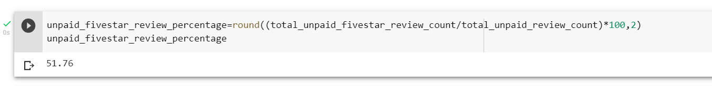
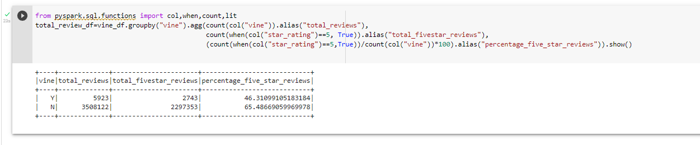

# Amazon_Vine_Analysis

## Overview & Purpose

The purpose of this project is to analyze Amazon reviews written by members of the paid Amazon Vine Program. The Amazon Vine program is a service that allows manufacturers and publishers to receive reviews for their products. Some companies pay a small fee to Amazon and provide products to Amazon Vine members, who are then required to publish a review.

For this project, the Automotive databse was selected from the [Amazon Review Datasets](https://s3.amazonaws.com/amazon-reviews-pds/tsv/index.txt) and PySpark was used to perform the ETL process to extract the dataset, transform the data, connect to an AWS RDS instance, and load the transformed data into pgAdmin (PostgreSQL). Then PySpark was used to determine if there is any bias toward favorable reviews from Vine members in the dataset.

##### Deliverable 1

AN AWS RDS database has been created with tables in pgAdmin. Using PySpark the dataframe has been transformed into four separate dataframes to match the table schema in pgAdmin. Then, the transformed data has been uploaded into appropriate tables in pgAdmin.

##### Deliverable 2

This deliverable determines if there is any bias towards reviews that were written as part of the Vine program

## Data Source
[Automotive](https://s3.amazonaws.com/amazon-reviews-pds/tsv/amazon_reviews_us_Automotive_v1_00.tsv.gz) Dataset

## Tools Used
- PySpark
- Google Colab Notebooks
- Amazon Web Services RDS
- PostgreSQL(pgAdmin)

## Results

Please note that for the purpose of this analysis, we had filtered our dataset by total_votes>20 and helpful_votes/total_votes greater than 50%.

***1. How many vine reviews and non-vine reviews were there?***

The number of total paid vine reviews - 82

The number of total unpaid vine reviews - 24,742

***2. How many Vine reviews were 5 stars? How many non-Vine reviews were 5 stars?***

The number of vine reviews that were 5 stars - 33

The number of non-vine reviews that were 5 stars - 12,807

***3. What percentage of Vine reviews were 5 stars? What percentage of non-Vine reviews were 5 stars?***

Percentage of 5 star vine reviews - 40.24%

Percentage of 5 star non-vine reviews - 51.76%

## Summary

Based on the results, we can conclude that there was no bias found in the reviews of the vine members for the automotive dataset. While only 40.24% of the paid members provided 5 star ratings, the percentage of non-paid members providing 5 star raings is much higher at 51.76%.

Furthermore,if we remove the filters on the dataframe for total_votes>20 and helpful_votes/total_votes>=50% and analyze the percentage of paid vs unpaid five-star reviews as a whole, we can reach a similar conclusion.

